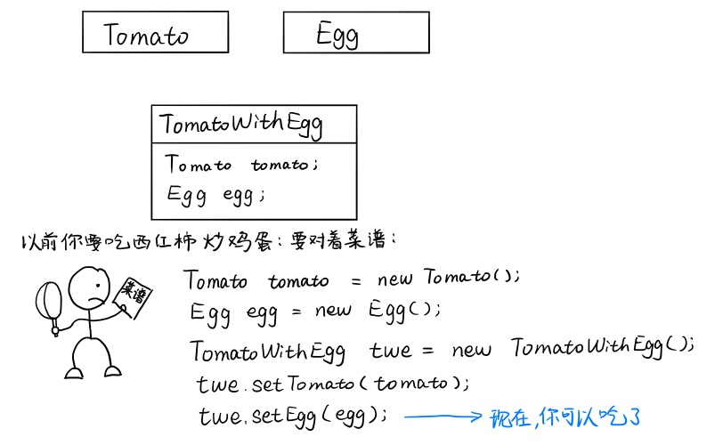
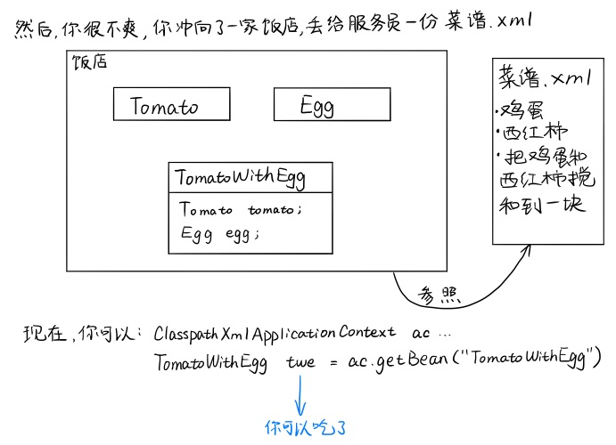
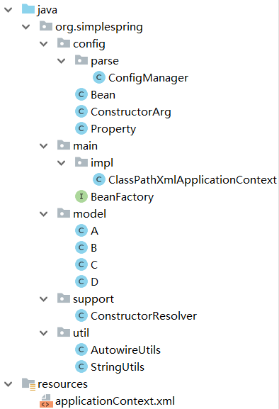

# 实现简单的 Spring IoC 框架

<!-- TOC -->

- [实现简单的 Spring IoC 框架](#实现简单的-spring-ioc-框架)
    - [IoC 概述](#ioc-概述)
    - [技术准备](#技术准备)
        - [dom4j 的简单使用](#dom4j-的简单使用)
        - [BeanUtils 的简单使用](#beanutils-的简单使用)
    - [实现流程](#实现流程)
        - [解析配置文件](#解析配置文件)
        - [根据配置文件解析结果初始化容器](#根据配置文件解析结果初始化容器)
        - [getBean 返回所需对象](#getbean-返回所需对象)
        - [测试](#测试)

<!-- /TOC -->

## IoC 概述

IoC (Inversion of Control)，即控制反转，或者称其为依赖注入更好理解一些，不过这个翻译还是比较晦涩难懂的，所以我们举一个吃西红柿炒鸡蛋的例子来说明一下（这例子不是我想的，是看别人的博客启发的……）。

之前我们要吃西红柿炒鸡蛋，是要自己做的，我们得先上下厨房查菜谱，去超市买西红柿（new Tomato），买鸡蛋（new Egg），然后把它俩放搅和到一块，我们才能有西红柿炒鸡蛋吃。就像这样：



可以看到，我们要 5 行代码才能得到 twe 对象（一盘西红柿炒鸡蛋），而且想吃一回，就给重复一次这 5 行代码，真的是相当的麻烦，可是这只是做法相当简单的西红柿炒鸡蛋啊，这要是想吃个圣诞节烤鸡就不要想着自己做了，即使能找到齐全的菜谱，正常人应该也懒得自己做，所以我们选择冲向饭店，也就是 Spring 容器：



现在，我们把 `菜谱.xml` 给饭店了，只要 Spring 容器初始化好了（饭店开门了），我们就对服务员（ac 对象）说：“给我来一盘西红柿炒鸡蛋”，然后服务员就会给我们端来一盘西红柿炒鸡蛋（ac.getBean("TomatoWithEgg")），只要想吃就向服务员要就行，是不是非常的方便呀。

而且这个饭店还是高度定制化的，你想吃啥就把 `菜谱.xml` 给它，它就会丝毫不差的照着菜谱给你做你想要的菜（构造你想要的对象），如果你想改造一下菜的做法，只消改一下给饭店的 `菜谱.xml` 就行，然后 Spring 容器就会照着新的 `菜谱.xml` 给你造对象。这相当于将应用程序的配置和依赖性规范与实际的应用程序代码分开，也就是说，我们现在要是想往西红柿炒鸡蛋里面放土豆块，只消在 `菜谱.xml` 中的原料表中加上土豆块，然后给 TomatoWithEgg 的属性中加上土豆块就可以了，不用去代码中搜索所有用到 TomatoWithEgg 对象的地方，再给它加上土豆块属性了。

也就是说，可以把 IoC 模式看做工厂模式的升华，IoC 就是一个大工厂，这个大工厂要生成的对象在 XML 中给出定义，然后就可以利用 Java 反射，根据 XML 中给出的类名生成相应的对象。这种做法有比工厂模式高级在哪里呢？以前的工厂模式都是在工厂方法中把对象的生成代码写死，而 Spring 容器则是由 XML 文件来定义类与类之间的关系，将工厂和对象生成两者独立开来。简单来说， **Spring IoC 就是我们把类与类之间的依赖关系在 XML 配置文件中写好，就不再自己 new 对象了，之后我们要用哪个对象就向 Spring 要，Spring 会帮我们按照我们定义的依赖关系给我们创建好相应的对象。**


## 技术准备

要实现一个简单的 IoC 框架，我们需要使用到如下技术：

- 解析 XML 文件（dom4j & XPath）
- 反射和内省（BeanUtils）

我们先在这里简单的写一下我们会用到的地方，至于详细的介绍可以看：

- [010-XML.md](./doc/010-XML.md)
- [011-反射与内省.md](./doc/011-反射与内省.md)

首先，我们要导包：

```xml
<!-- 解析 XML 要用到的包 -->
<dependency>
    <groupId>dom4j</groupId>
    <artifactId>dom4j</artifactId>
    <version>1.6.1</version>
</dependency>

<dependency>
    <groupId>jaxen</groupId>
    <artifactId>jaxen</artifactId>
    <version>1.1.6</version>
</dependency>

<!-- 通过字符串类名创建对应类的对象并且为对象注入属性要用到的包 -->
<dependency>
    <groupId>commons-beanutils</groupId>
    <artifactId>commons-beanutils</artifactId>
    <version>1.9.3</version>
</dependency>
```

### dom4j 的简单使用

```java
// 获取xml配置文件的输入流
InputStream xmlConfigFile = ConfigManager.class.getResourceAsStream(path);
// 创建xml文件解析器
SAXReader reader = new SAXReader();
try {
    // 得到xml文件的Document对象
    Document doc = reader.read(xmlConfigFile);
    // 取出所有<bean>标签
    List<Element> beans = doc.selectNodes("//bean");
    // 遍历<bean>标签
    for (Element bElement : beans) {
        // 取出name属性值
        String bName = bElement.attributeValue("name");
        // 取出bean下的<property>标签
        List<Element> properties = bElement.elements("property");
    }
} catch (DocumentException e) {}
```

### BeanUtils 的简单使用

```java
User user = new User();
BeanUtils.setProperty(user, "username", "admin");
BeanUtils.setProperty(user, "password", "admin123");
```


## 实现流程

整个实现流程分为以下几步：

- 读取配置文件，将配置文件信息加载进容器（dom4j）；
- 根据配置文件初始化容器，创建容器需要创建的 Bean 对象（BeanUtils）；
- 通过 `getBean(String beanName)` 方法获取我们想要的 Bean 对象。

代码结构如下：



### 解析配置文件

我们需要做的一切都是要基于配置文件的，所有先来看一下配置文件的格式：

```xml
<?xml version="1.0" encoding="UTF-8"?>
<beans>
    <bean name="A" class="org.simplespring.model.A">
        <property name="strData" value="A的strData"/>
        <property name="intData" value="123"/>
    </bean>

    <bean name="B" class="org.simplespring.model.B">
        <property name="refData" ref="A"/>
    </bean>

    <bean name="C" class="org.simplespring.model.C" scope="prototype">
        <property name="strData" value="C的strData"/>
    </bean>
    
    <bean name="D" class="org.simplespring.model.D">
        <constructor-arg index="0" type="java.lang.String" value="D的name属性值"/>
        <constructor-arg index="1" type="java.lang.String" value="D的value属性值"/>
        <constructor-arg index="2" type="org.simplespring.model.A" ref="A"/>
    </bean>
</beans>
```

我们配置了 3 个类：A、B、C，其中 A 和 B 是 singleton 的，也就是说是单例的，只在容器初始化时创建一次，每次调用 getBean 返回的都是同一个对象；C 是多例的，即每次调用 getBean 都返回一个新创建的对象。

我们首先需要考虑的事情是，我们解析出来的 xml 文件的内容应该放在哪里呢？我们采用的解决方案是：创建 3 个 Model 类：`Bean` 、 `Property` 和 `ConstructorArg`，专门放解析出来的 `<bean>` 、 `<property>` 和 `<constructor-arg>` 标签。然后我们把解析出来的 Bean 类放到一个 `Map<String, Bean>` 中，其中 key 是我们配置的 bean 标签的 name，value 就是对应的 Bean 对象。这部分的实现在 `org.simplespring.config.parse.ConfigManager.java` 中：

- **方法：** `public static Map<String, Bean> getConfig(String path)`
- **流程：**
  - 创建解析器：SAXReader
  - 加载 XML 文件
  - 定义 xpath 表达式：`"//bean"`，取出所有 Bean
  - 对 Bean 元素进行遍历，并通过 `setBean` 方法进行解析
    - 将 `<bean>` 标签的 name & class & scope 属性封装到 Bean 对象中
    - 调用 `setBeanConstructorArg(Element bElement, Bean bean)` 方法，解析 `<constructor-arg>` 标签
    - 调用 `setBeanProperties(Element bElement, Bean bean)` 方法，解析 `<property>` 标签
    - 将 Bean 对象封装到 Map res 中（这个 Map 就是我们的返回结果）
  - 返回 Map res


constructor-arg：通过构造函数注入。 
property：通过setter对应的方法注入。
`<property>` 标签的解析较为简单，而 `<constructor-arg>` 标签的解析却不是那么的容易，因为如果像 `<property>` 标签一样，在 Bean 中仅仅通过一个 `List<Property>` 来存储的话，我们之后将很难通过配置文件给出的配置信息来确定到底应该执行哪一个构造函数来创建对象。因此，为了方便后面构造函数匹配的实现，我们在 Bean 中通过以下结构来存储 `<constructor-arg>` 标签的信息：

```java
/** 用来存储通过索引定位的构造函数参数 */
private final Map<Integer, ConstructorArg> indexConstructorArgs = new HashMap<>();

/** 用来存储不索引定位的构造函数参数 */
private final List<ConstructorArg> genericConstructorArgs = new ArrayList<>();
```

因此，在解析 `<constructor-arg>` 标签时，优先解析 index 属性，将解析结果放入 Bean 的 `Map<Integer, ConstructorArg> indexConstructorArgs` 集合中，如果该标签没有 index 属性，则将解析结果放入 Bean 的 `List<ConstructorArg> genericConstructorArgs` 集合中。

具体实现详见：[ConfigManager.java](./src/main/java/org/simplespring/config/parse/ConfigManager.java).

### 根据配置文件解析结果初始化容器

可以成功的解析配置文件之后，我们就可以进行容器的初始化了，我们先构造一个 `BeanFactory` 接口，容器的实现类都实现于这个接口，这个接口中有一个 `getBean(String beanName)` 方法，用于从容器中获取我们在配置文件中配置的对象。

```java
public interface BeanFactory {
    public Object getBean(String beanName);
}
```

然后，我们写一个这个接口的实现类：`org.simplespring.main.impl.ClassPathXmlApplicationContext`，来真正的进行容器的初始化。

首先我们要在 ClassPathXmlApplicationContext 的构造函数中调用我们上一小节写的 `ConfigManager.getConfig(path)` 加载配置文件进来，然后根据配置文件的配置内容，创建相应的对象，并放入一个 `Map<String, Object>` 中，其中 key 是我们在配置文件中给该对象配置的 name，value 是容器创建的对象，也是我们之后要通过 getBean 从容器中取的东西。

也就是说，ClassPathXmlApplicationContext 的初始化过程中，我们要完成：

- 读取配置文件中需要初始化的 Bean 信息： `ConfigManager.getConfig()`
- 遍历配置对象 Map，初始化所有不是 prototype 的 Bean
	- 通过方法 `Object object = createBean(beanInfo);` 完成
	- 将初始化好的 Bean 放入 `Map<String, Object> beanMap` 中

接下来就是实现关键的 createBean 方法了：

- **方法：** `private Object createBean(Bean beanInfo)`
- **流程：**
  - 判断容器中是否已经存在该实例，如果存在，直接返回即可
  - 获取要创建的 Bean 的 Class，调用 `newObject(Bean beanInfo, Class beanClass)` 方法创建对象
  - 获取 Bean 需要的属性对象，将其注入到Bean中
    - value 属性注入：`prop.getValue() != null`
    	- `BeanUtils.setProperty(object, property.getName(), property.getValue())`
    - ref 属性注入：`prop.getRef() != null`
    	- 先来判断一下要加载的 ref 类是否已经创建并放入容器中了
    		- 不存在：递归调用 createBean 方法
    		- 存在：直接从容器中取出并注入
  - 返回创建好的 object

在创建对象时，我们调用了 `newObject(Bean beanInfo, Class beanClass)` 方法，在没有配置 constructor-arg 时，Spring 容器会选择使用无参构造函数创建对象，及直接调用 `beanClass.newInstance()` 方法完成对象的创建。但是当配置文件中配置了 constructor-arg 时，容器就需要通过配置文件中 `<constructor-arg>` 标签的 type 和 index 属性的配置来选择合适的构造函数创建实例了，具体的匹配方法将会在 ConstructorResolver.matchConstructor 方法的实现流程中进行详细说明，我们首先来看一下 newObject 方法的实现，以下是 newObject 方法的详细实现流程：

- **方法：** `public Object newObject(Bean beanInfo, Class beanClass)`
- **流程：**
	- 如果 beanInfo 中没有 constructor-arg 的配置信息，直接调用 `beanClass.newInstance()` 创建对象返回
	- 调用 `ConstructorResolver.matchConstructor(Bean beanInfo, Class beanClass, BeanFactory beanFactory)` 方法搜索匹配的构造函数及其参数列表
	- 如果能搜索到，则通过反射调用构造函数创建对象，如果无法搜索到则抛出异常

createBean 和 newObject 方法的具体实现详见：[ClassPathXmlApplicationContext.java](./src/main/java/org/simplespring/main/impl/ClassPathXmlApplicationContext.java).

`ConstructorResolver.matchConstructor(Bean beanInfo, Class beanClass, BeanFactory beanFactory)` 方法的详细实现流程：

- **方法：** `public static ArgumentsHolder matchConstructor(Bean beanInfo, Class beanClass, BeanFactory beanFactory)`
- **流程：**
	- 从 beanClass 中取出该类所有的构造函数，并对构造函数们按照 public 在前，参数个数多的在前的顺序进行排序，以方便后面的匹配操作
	- 遍历所有的构造函数，并将每个构造函数的参数数组与配置文件中配置的参数进行匹配
		- 首先按照构造函数的入参个数进行匹配
		- 匹配到入参个数相同的构造函数时，根据 beanInfo 中读取的构造函数参数配置信息，生成对应于当前构造函数的参数列表，生成的过程对参数的类型进行匹配，只有每个位置的参数都符合配置文件中配置的构造函数才能作为匹配结果返回，在遍历参数列表过程中：
			- 先获取配置文件中配置在该 index 下的参数
			- 如果当前位置未设置参数，就按照类型搜索参数
			- 如果按照类型也搜索不到就获取 `beanInfo.genericConstructorArgs` 中第一个没有使用的参数作为该位置的参数
			- 获得当前位置的参数后，对类型匹配判断，如果类型与当前正在匹配的构造函数相应位置的入参相同，则匹配成功，可以继续匹配下一个参数，如果类型匹配不成功，则当前构造函数匹配失败，跳过该构造函数，继续匹配下一个构造函数

ConstructorResolver 类的具体实现详见：[ConstructorResolver.java](./src/main/java/org/simplespring/support/ConstructorResolver.java).

通过以上复杂的构造函数匹配流程，我们也可以理解为什么一般建议使用 set/get 方法的方式注入属性了，因为构造函数注入属性的方式除了存在循环依赖的问题，在容器初始化的时候，由于需要匹配合适的构造函数，会增加容器的初始化时间。

### getBean 返回所需对象

getBean 方法的实现十分简单，流程如下：

- **方法：** `public Object getBean(String beanName)`
- **流程：**
  - 从 Map configs 中取出该 bean 的配置，判断 scope 属性
    - scope == "prototype"：调用 createBean 新创建一个对象返回
    - scope != "prototype"：直接从 beanMap 中取出对象返回

### 测试

我们在 `ClassPathXmlApplicationContextTest` 进行了简单的测试：

```java
String path = "/applicationContext.xml";
BeanFactory factory = new ClassPathXmlApplicationContext(path);
A a1 = (A) factory.getBean("A");
B b1 = (B) factory.getBean("B");
C c1 = (C) factory.getBean("C");

A a2 = (A) factory.getBean("A");
C c2 = (C) factory.getBean("C");

D d1 = (D) factory.getBean("D");

System.out.println(a1);
System.out.println(b1);
System.out.println(c1);
System.out.println(a2);
System.out.println(c2);
System.out.println(d1);
```

输出结果：

```
创建A对象一次
创建B对象一次
创建C对象一次
创建C对象一次
A{strData='A的strData', intData=123}
B{refData=A{strData='A的strData', intData=123}}
C{strData='C的strData'}
A{strData='A的strData', intData=123}
C{strData='C的strData'}
D{nameAttribute='D的name属性值', valueAttribute='D的value属性值', refAttribute=A{strData='A的strData', intData=123}, doubleAttribute=0.0}
```

我们创建了 2 个 A 和 C 对象，一个 B 对象，通过观察输出结果可以发现，A 对象只会被创建一次，而 C 对象被创建了两次（根据构造函数的执行次数判断的，ABC 每个类的构造函数都会 print "创建X对象一次"），并且我们在配置文件中配置的属性也被注入进了相应的对象，A 对象中的 int 型和 String 型数据都被很好的注入了。至此，简单的 Spring IoC 框架实现完毕。

